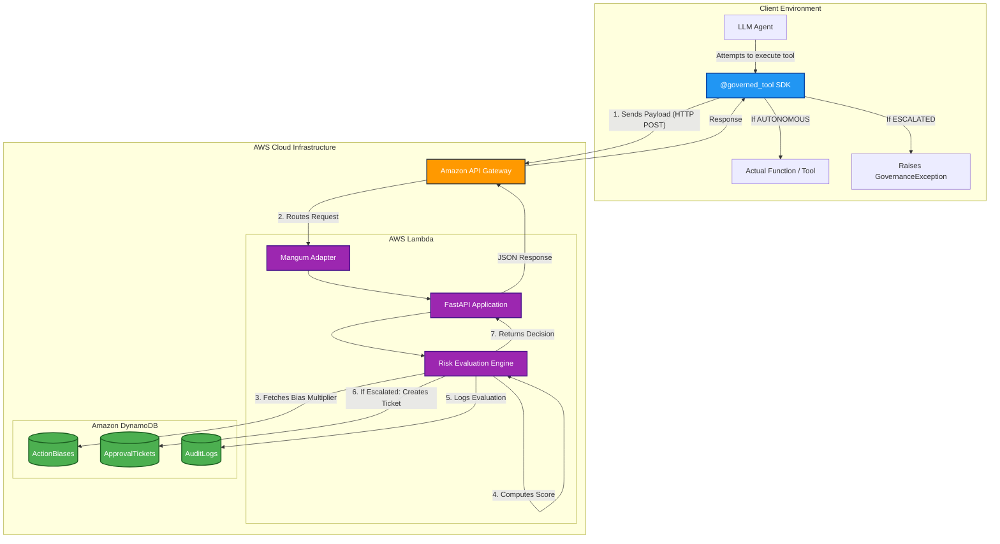

# AutonomyGuard: Technical Documentation

AutonomyGuard is a production-ready, serverless governance layer designed to monitor, evaluate, and gate the actions of autonomous AI agents. It acts as an interceptor between an AI agent and the tools it executes, ensuring that high-risk actions are escalated for human approval while low-risk actions are executed seamlessly.

---

## 1. Architecture Overview

AutonomyGuard is built on a modern, fully serverless architecture using **Python, FastAPI, and AWS Native Services**.



### 1.1 Core Components
- **API Gateway**: Provides a secure HTTP interface for agents to communicate with the governance engine.
- **AWS Lambda**: Hosts the core Python FastAPI application. We use `mangum` as an adapter to bridge AWS API Gateway events into FastAPI ASGI requests.
- **Amazon DynamoDB**: Provides highly scalable, serverless NoSQL persistence. 
  - `AutonomyGuard-AuditLogs`: Immutable ledger of every action evaluated.
  - `AutonomyGuard-Approvals`: Stores pending tickets for human-in-the-loop review.
  - `AutonomyGuard-ActionBiases`: Stores Exponential Weighted Moving Average (EWMA) multipliers to dynamically adjust risk scores based on past action frequency.

### 1.2 System Workflow
1. **Interception**: The AI agent attempts to use a tool wrapped in the `@governed_tool` Python SDK decorator.
2. **Evaluation**: The SDK sends a payload to the `/v1/evaluate` endpoint.
3. **Risk Computation**: 
   - The engine calculates a raw risk score using factors like `reversibility`, `records_affected`, `regulatory_category`, and `llm_confidence`.
   - The raw score is multiplied by the dynamically learned `bias_multiplier`.
4. **Decision**:
   - **AUTONOMOUS**: If `score < 0.4`, the action is permitted and the SDK executes the tool.
   - **ESCALATED**: If `score >= 0.4`, the action is blocked, an `ApprovalTicket` is created in DynamoDB, and the SDK returns a `tool_error` asking the LLM to wait for human approval.

---

## 2. Development Guide

### 2.1 Local Environment Setup
The project is built using Python 3.12 (with deployment targeting 3.12 as well).
```bash
# Create virtual environment
python3 -m venv venv
source venv/bin/activate

# Install dependencies (including server components)
pip install -e '.[server]'
```

### 2.2 Local Testing
To test the API locally without deploying to AWS, you can run the FastAPI server using Uvicorn:
```bash
uvicorn autonomy_guard.main:app --reload
```
> [!NOTE]
> Since the database layer natively uses `aioboto3` (DynamoDB), your local machine must have valid AWS credentials configured (`aws configure`) to interact with the remote DynamoDB tables, even when testing locally.

### 2.3 The SDK Integration

Other developers can easily integrate AutonomyGuard into their AI agents using the provided Python SDK. 

#### Installation
To install the SDK, developers can install it directly via pip. Since this acts as a client library, they do not need the server dependencies:
```bash
# Install from a local path
pip install /path/to/autonomy_guard

# Or install directly from your GitHub repository
pip install git+https://github.com/Narain3108/Graduated-Autonomy-Risk-Governance-Engine.git
```

#### Usage and Payload Structure
When an AI agent attempts to execute a tool, the SDK automatically packages the metadata and sends an **Evaluation Payload** to the AWS API Gateway. 

The `@governed_tool` decorator handles this entirely behind the scenes:
```python
from autonomy_guard import AutonomyGuardClient, governed_tool

# 1. Point the client to your deployed AWS API Gateway
client = AutonomyGuardClient(base_url="https://<YOUR_API_ID>.execute-api.us-east-1.amazonaws.com/v1")

# 2. Wrap any AI tool with the governance decorator
@governed_tool(
    client=client,
    agent_id="my-gemini-agent",
    action_type="WRITE",
    reversibility=0.1,  # (0.0 to 1.0) Low reversibility = high risk
    regulatory_category="FINANCIAL" # e.g. PUBLIC, INTERNAL, FINANCIAL
)
def execute_sql_query(query: str):
    return run_query(query)
```

#### The Evaluation Payload
When `execute_sql_query` is called by the LLM, the SDK intercepts the call and securely sends the following JSON payload to the `/v1/evaluate` endpoint:
```json
{
  "agent_id": "my-gemini-agent",
  "action_type": "WRITE",
  "tool_name": "execute_sql_query",
  "reversibility": 0.1,
  "records_affected": 1,
  "regulatory_category": "FINANCIAL",
  "llm_confidence": 0.85,
  "payload_summary": "{\"query\": \"DROP TABLE users;\"}"
}
```
If the AWS Serverless engine returns `AUTONOMOUS`, the decorator immediately runs the SQL query. If it returns `ESCALATED`, the decorator raises a `ToolException` to halt the AI agent and tell it to await human approval.

---

## 3. Deployment (AWS SAM)

The project leverages **AWS Serverless Application Model (SAM)** for Infrastructure as Code (IaC) and CI/CD automation. 

### 3.1 Prerequisites
- AWS CLI installed and configured (`aws configure`)
- AWS SAM CLI installed
- Python 3.12

### 3.2 The Deployment Script (`deploy.sh`)
We have provided a streamlined `deploy.sh` script that automates the entire packaging and deployment lifecycle.

1. **Packaging**: The script copies the source code to a `sam_build_src` directory and dynamically generates a clean `requirements.txt`.
2. **Building**: It invokes `sam build`. SAM's native `PythonPipBuilder` parses the requirements and downloads AWS Lambda-compatible binaries (such as the Rust extensions for `pydantic_core`), ensuring 100% binary compatibility with the Lambda runtime.
3. **Deploying**: It runs `sam deploy` to upload the artifact to an S3 bucket and execute the CloudFormation changeset.

### 3.3 Deployment Steps
To deploy or update the stack, simply run:
```bash
chmod +x deploy.sh
./deploy.sh
```

### 3.4 Infrastructure as Code (`template.yaml`)
The infrastructure is defined declaratively. The template automatically provisions:
- The Lambda Function (`AutonomyGuardFunction`) running Python 3.12
- An API Gateway (`ServerlessHttpApi`)
- IAM Policies allowing the Lambda function full access to DynamoDB
- Three DynamoDB tables with On-Demand billing (Pay-Per-Request)

---

## 4. Key Design Decisions

> [!TIP]
> **Why DynamoDB over SQLite/PostgreSQL?**
> A serverless API requires a serverless database. Traditional SQL databases maintain persistent connection pools that break down in highly concurrent, ephemeral Lambda environments. DynamoDB provides a connectionless HTTP API (`aioboto3`) perfectly suited for Lambda concurrency.

> [!TIP]
> **Why SAM over Serverless Framework/Node.js?**
> The project is entirely Python-based. Introducing the `serverless` framework requires installing Node.js, `npm`, and managing a sprawling `node_modules` directory just for deployment. AWS SAM is a native AWS tool written in Python, keeping the developer environment clean and unified.

> [!IMPORTANT]
> **Float Serialization in DynamoDB**
> The DynamoDB API natively rejects standard Python `float` types. Our Data Access Layer (`autonomy_guard/db/repository.py`) intercepts all Pydantic model serialization and strictly casts all floats to `decimal.Decimal` objects to prevent `TypeError` exceptions during database writes.
